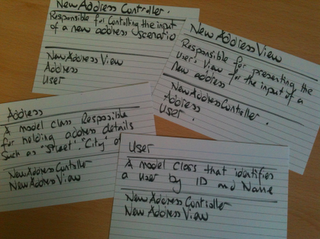

# CompSci 308: Game Project Design Review

### Name: 

> This is the link to the [assignment](http://www.cs.duke.edu/courses/compsci308/current/assign/01_game/):

## Status

You need to put blank lines to write some text

in separate paragraphs.


You can also make lists:

* Bullets are made with asterisks

1. You can order things with numbers.


Emphasis, aka italics, with *asterisks* or _underscores_.

Strong emphasis, aka bold, with **asterisks** or __underscores__.

Combined emphasis with **asterisks and _underscores_**.


You can put links to commits like this: [My favorite commit](https://coursework.cs.duke.edu/compsci308_2019spring/example_bins/commit/ae099c4aa864e61bccb408b285e8efb607695aa2)


## Design

You can put blocks of code in here like this:
```java
    /**
     * Returns sum of all values in given list.
     */
    public int getTotal (Collection<Integer> data) {
        int total = 0;
        for (int d : data) {
            total += d;
        }
        return total;
    }
```

## Alternate Designs

Here is another way to look at my design:



