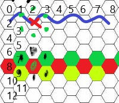

# CompSci 308: Simulation Project Design Review

### Name: Tyler Jang

> This is the link to the [assignment](http://www.cs.duke.edu/courses/compsci308/current/assign/02_simulation/):


## Overall Design

The design is divided into a Model, View, and Controller, with the Controller facilitating updating states between both the Model and View.

**Model**:
 - Grid.java acts as an abstract class and defines some basic grid implementation and accessing for its sub-classes.
    - FireGrid.java implements Grid.java for Fire simulations.
    - GameOfLifeGrid.java implements Grid.java for Game Of Life simulations.
    - PercolationGrid.java implements Grid.java for Percolation simulations.
    - PredatorPreyGrid.java implements Grid.java for Predator-Prey simulations.
    - RockPaperScissorsGrid.java implements Grid.java for Rock-Paper-Scissors simulations.
    - SegregationGrid.java implements Grid.java for Segregation simulations.
 - Cell acts as an abstract class and defines some basic cell implementation and accessing for its sub-classes.
     - FireCell.java implements Grid.java for Fire simulations.
     - GameOfLifeCell.java implements Cell.java for Game Of Life simulations.
     - PercolationCell.java implements Cell.java for Percolation simulations.
     - PredatorPreyCell.java implements Cell.java for Predator-Prey simulations.
     - RockPaperScissorsCell.java implements Cell.java for Rock-Paper-Scissors simulations.
     - SegregationCell.java implements Cell.java for Segregation simulations.
 - To add new simulation types, implement a Grid.java sub-class and Cell.java sub-class that handle its updating algorithm.
     
**View**:
 - ApplicationView.java acts as the hub for all other GridPanes, delegating control to GridView.java/HexagonGridView.java, DashboardView,java, and ConsoleView.java.
 - GridView.java exists as an abstract parent to RectangleGridView.java and HexagonGridView.java, which handle the grid and its cells, creating CellView.java panes with ImageCellState.java and ColoredCellState.java (sub-classes of the abstract CellState.java) based on CellStateConfiguration.java information.
 - Each cell pane has a CellClickedEvent.java handler. 
 - To add new simulation types, no changes are necessary.

**Controller**:
 - Main.java should launch an Application, and in doing so create an instance of SimulationControl.java, passing in the Application stage. On each frame update, it should call SimulationControl.next().
 - SimulationControl.java will create an initialize instances of ApplicationView.java and Grid.java, based on configuration and styling information parsed by ConfigParser.java and StyleParser.java. It also provides a handler to ApplicationView.java with which XML files can be written using WriteXMLFile.java.
    - ConfigParser.java reads in information from an XML file and stores it in a Simulation.java instance that adheres to conventions set by SimType.java. In doing so it also uses parsing mechanisms defined in GridParser.java.
    - StyleParser.java reads in information from an XML file and stores it in a Style.java instance that adheres to conventions set by SimStyle.java.
    - SimType.java and SimStyle.java are enumerated types specifying the necessary fields for each Simulation and Style type.
    - WriteXMLFile.java creates an XML file based on the grid status and configuration parameters of the current simulation and saves it in data/.
 - To add new simulation types, simply add a value to the enumerated types in SimType.java and SimStyle.java, specifying the necessary fields, max value, and style information. Then, create an XML file with the desired configuration parameters.
 This XML file must have the root element data type = "simulation", and it must have title and the other required mandatory fields specified in SimType.java. In addition, add an element and children to Styling.xml specifying the desired global style
 configuration for that new simulation. 

 The dependencies of the project exist in logical flows (with the higher-level classes having calls to the lower-level classes but not the other way around). The singular exception is with regard to the ResourceBundle settings, in which most classes have a reference to
 Main.myResources so that all classes can be reading from the same properties file. SimulationControl.java depends on the View and Model, but not vice versa.

## Your Design

**Controller Design**:
 - Main.java should launch an Application, and in doing so create an instance of SimulationControl.java, passing in the Application stage. On each frame update, it should call SimulationControl.next().
 - SimulationControl.java will create an initialize instances of ApplicationView.java and Grid.java, based on configuration and styling information parsed by ConfigParser.java and StyleParser.java. It also provides a handler to ApplicationView.java with which XML files can be written using WriteXMLFile.java.
    - ConfigParser.java reads in information from an XML file and stores it in a Simulation.java instance that adheres to conventions set by SimType.java. In doing so it also uses parsing mechanisms defined in GridParser.java.
    - StyleParser.java reads in information from an XML file and stores it in a Style.java instance that adheres to conventions set by SimStyle.java.
    - SimType.java and SimStyle.java are enumerated types specifying the necessary fields for each Simulation and Style type.
    - WriteXMLFile.java creates an XML file based on the grid status and configuration parameters of the current simulation and saves it in data/.

**Design Checklist**:

One thing I worked to implement was the removal of hard-coded Strings in my code. I used English.properties (a resource file)
for all the Strings I used. This was good for outputting to the front-end, but perhaps it went too far with instances like the declarations in the top of SimStyle.java. This also created a potential dependency issue. This did allow for changes to be made easily between the Controller and Model.
```java
  GAME_OF_LIFE(Main.myResources.getString("GameOfLife"),
      new String[]{Main.myResources.getString("Empty"), Main.myResources.getString("Alive")}),
  PERCOLATION(Main.myResources.getString("Percolation"),
      new String[]{Main.myResources.getString("Blocked"), Main.myResources.getString("Empty"),
          Main.myResources.getString("Water")}),
  SEGREGATION(Main.myResources.getString("Segregation"),
      new String[]{Main.myResources.getString("Empty"), Main.myResources.getString("A"),
          Main.myResources.getString("B")}),
  PREDATOR_PREY(Main.myResources.getString("PredatorPrey"),
      new String[]{Main.myResources.getString("Empty"), Main.myResources.getString("Fish"),
          Main.myResources.getString("Shark")}),
  FIRE(Main.myResources.getString("Fire"),
      new String[]{Main.myResources.getString("Empty"), Main.myResources.getString("Trees"),
          Main.myResources.getString("Burning")}),
  ROCK_PAPER_SCISSORS(Main.myResources.getString("RockPaperScissors"),
      new String[]{Main.myResources.getString("Rock"), Main.myResources.getString("Paper"),
          Main.myResources.getString("Scissors")});
```

Otherwise, I sought to remove magic values, creating constants that were shared throughout the entire application (connecting Model and Controller when appropriate).

I avoided in-line comments, instead commenting every one of my methods for every class I implemented.

I attempted to make my code modular, using XMLParser.java as an abstract class and having the case where ConfigParser.java uses GridParser.java to simplify its operations.
A contract existed in which ConfigParser.java depended on GridParser.java to give it a Map of Points to Integer values, and GridParser.java had the freedom to implement it, dependent on a few field values (i.e. shape).

The majority of issues caught by the static analysis involved me either catching an Exception and replacing it with XMLException (for standardization purposes and logging to the console), or using a Map with Points as a Key, which
apparently do not have a hashCode() function defined. I concluded that these were allowable issues for the scope of this project, since they allowed for the modularity of my code.

**Two Implemented Features**:

One feature that I implemented well was XML parsing. I used a stable hierarchy, with XMLParser.java being the abstract parent of:
 - ConfigParser.java
 - GridParser.java
 - StyleParser.java
 
These all depended on differently-structured XML files, and each had the potential to be different for each simulation type. Thus, this allowed
for encapsulation and "telling the other guy." Another thing that this feature did well was error handling. I checked for invalid types and invalid/missing attributes in the XML files:
 - Simulation.java:
 ```java
private void extractMandatoryValues(Map<String, String> dataValues) {
    ...
        } catch (NumberFormatException e) {
          throw new XMLException(RESOURCES.getString("XML_DATA_TYPE_MESSAGE"),
              MANDATORY_DATA_FIELDS.get(k));
        }
      } else {
        throw new XMLException(MISSING_MESSAGE, myType);
      }
    ...
  }
```
 - GridParser.java
 ```java
public GridParser(DocumentBuilder docBuilder, File dataFile, Simulation sim) {
    ...
    try {
      Integer shape = sim.getValue(RESOURCES.getString("Shape"));
      if (shape != null && shape >= HEXAGON) {
        myShape = shape;
      } else {
        myShape = SQUARE;
      }
    } catch (NumberFormatException e) {
      throw new XMLException(RESOURCES.getString("XML_DATA_TYPE_MESSAGE"),
          RESOURCES.getString("WidthHeight"));
    }

    try {
      myDoc = docBuilder.parse(dataFile);
    } catch (SAXException e) {
      throw new XMLException(String.format(RESOURCES.getString("BadFormat"), dataFile.getName()));
    } catch (IOException e) {
      throw new XMLException(String.format(RESOURCES.getString("FileMissing"), dataFile.getName()));
    }
  }
```

One feature that I could have improved is with regard to the structure of SimType.java and SimStyle.java. These are both enumerated types that specify information for each and every simulation.
SimType.java deals with configuration information for the simulation, whereas SimStyle.java deals with styling choices. I thought about combining these enumerated types into one, but given the 
amount of information baked into each one's values, I kept it separated. This is illustrated below:
 - SimType.java
 ```java
  GAME_OF_LIFE(Main.myResources.getString("GameOfLife"), new String[]{},
      new String[]{Main.myResources.getString("Coverage")}, 1),
  PERCOLATION(Main.myResources.getString("Percolation"), new String[]{},
      new String[]{Main.myResources.getString("Blocked"), Main.myResources.getString("Filled")}, 2),
  SEGREGATION(Main.myResources.getString("Segregation"), new String[]{},
      new String[]{Main.myResources.getString("Similar"), Main.myResources.getString("Red"),
          Main.myResources.getString("Empty")}, 2),
  PREDATOR_PREY(Main.myResources.getString("PredatorPrey"), new String[]{},
      new String[]{Main.myResources.getString("FishBreed"),
          Main.myResources.getString("SharkStarve"), Main.myResources.getString("SharkBreed"),
          Main.myResources.getString("Shark"), Main.myResources.getString("Empty")}, 2),
  FIRE(Main.myResources.getString("Fire"), new String[]{},
      new String[]{Main.myResources.getString("Catch"), Main.myResources.getString("Trees")}, 2),
  ROCK_PAPER_SCISSORS(Main.myResources.getString("RockPaperScissors"), new String[]{},
      new String[]{Main.myResources.getString("Rock"), Main.myResources.getString("Paper"),
          Main.myResources.getString("RPSThreshold")}, 3);
```
 - SimStyle.java
 ```java
  GAME_OF_LIFE(Main.myResources.getString("GameOfLife"),
      new String[]{Main.myResources.getString("Empty"), Main.myResources.getString("Alive")}),
  PERCOLATION(Main.myResources.getString("Percolation"),
      new String[]{Main.myResources.getString("Blocked"), Main.myResources.getString("Empty"),
          Main.myResources.getString("Water")}),
  SEGREGATION(Main.myResources.getString("Segregation"),
      new String[]{Main.myResources.getString("Empty"), Main.myResources.getString("A"),
          Main.myResources.getString("B")}),
  PREDATOR_PREY(Main.myResources.getString("PredatorPrey"),
      new String[]{Main.myResources.getString("Empty"), Main.myResources.getString("Fish"),
          Main.myResources.getString("Shark")}),
  FIRE(Main.myResources.getString("Fire"),
      new String[]{Main.myResources.getString("Empty"), Main.myResources.getString("Trees"),
          Main.myResources.getString("Burning")}),
  ROCK_PAPER_SCISSORS(Main.myResources.getString("RockPaperScissors"),
      new String[]{Main.myResources.getString("Rock"), Main.myResources.getString("Paper"),
          Main.myResources.getString("Scissors")});
```
 
The similarity is clear. However, I was unable to find a solution that kept my code short and readable within my knowledge of how enumerated types work.

## Flexibilty

Some of this project's components are flexible while others are not. The most flexible component is the addition of new simulations (described above in "Overall Design").
Minimal changes are needed to add a new simulation type. New XML files can be generated as well, with many different specified grid configuration (we allowed for ALL, SOME, RANDOM, AND PARAMETRIZED RANDOM grid specification).

Other components are less flexible, and these deal with configuration and modifications on the front-end that have to do with pipelining difficulties. This primarily includes the addition of multiple simulations.

**Two easily implemented features**:
 - Rock-Paper-Scissors: This additional simulation required merely some additions to SimType and SimStyle, as well as the creation of the RockPaperScissorsGrid.java and RockPaperScissorsCell.java classes, with the implementation of the latter's calculateNextState() method. 
 - Hexagons: While it took some tinkering on the front-end, adding hexagons to the back-end required only two major additions: defining a coordinate system and reading in "ALL" grid types, and pipelining the shape to the Model so that the neighborhood could be specified. 
```java
  protected void buildHexagonNeighbors() {
    for (Point p : pointCellMap.keySet()) {
      int xPos = (int) p.getX();
      int yPos = (int) p.getY();

      for (int x = -2; x <= 2; x++) {
        for (int y = -1; y <= 1; y++) {
          checkAndSetNeighbor(p, xPos, yPos, x, y);
        }
      }
    }
  }
```

**Two unimplemented features**:
 - Triangles: We did not implement triangles in our final submission. While it would not have been that difficult (and it would have been very analogous to Hexagons), we would have had to go through the process again of defining a coordinate system for triangles (see "Alternate Designs"). It would also have been much more work for Mariusz, who was working on additional front-end features.
 - Langston Loops: We did not implement the "infinite" grid type. We worked to add toroidal implementation, but the grid's ability to change size was not accounted for in our original design. Many of the components (usually SimulationControl.java), require that width and height are fixed (or at least defined with certainty). Allowing the grid to change size
 would have required that the Model create new Cells (based on the grid shape) each frame, and the View would have had to do the same. This would have dramatically slowed down our program due to JavaFX's need to create additional instances of many of our classes.
 This is probably one of the least extensible parts of our design, because of the amount of pipelining and re-initializing this would have required. 

## Alternate Designs

**Changing the grid structure**:

The Model and Controller both independently use Maps to keep track of cells, but they only share this by exchanging information by the Keys, the Points. These could very easily be changed to an x and y coordinate, and this would cause other features to be largely unchanged.
The View uses a Collection to keep track of its cells, which can be accessed by iteration or index. The Cell stores its column and row internally, and they are modified using updateCell (see below).
```java
public void updateCell(int row, int column, int state) {
  for (CellView cell : myCells) {
    if (myGrid.getColumnIndex(cell) == column && myGrid.getRowIndex(cell) == row) {
      cell.changeState(state);
    }
  }
}
```

**Project extensions**:

While there were many project extensions for the Controller, most of them were not far from our Basic sprint implementation, and so it
was not difficult to add the error handling and other features. The Model and View, however, had the task of dealing with different cell shapes.
The Model was available to define different neighborhoods and different random cell generation to cover this feature. The View, however, had to modify its use
of pains, which a considerable amount of time for Mariusz.

In designing how and when we implemented these changes, we took our existing model from our Design Plan exercise, and we determined what pipelines would be made.
Extensions that required large amounts of pipelining (like hexagons or cell images) were prioritized, while individual projects (like error handling) were done 
almost in isolation (except when people needed help). 


**Large design decisions**:

One of the larger design decisions that was considered upon the release of the Complete sprint was how we were going to implement hexagons.
We considered different coordinate systems for hexagons, ultimately settling on the one pictured below. This offered the benefit that a cell defined at (x,y) could have its neighbors
defined by (x-1, y+1), (x-1, y-1), (x, y+2), (x, y-2), (x+1, y+1), and (x+1, y-1). This was easy enough to implement in the Model.
With the benefit of hindsight, however, I would have preferred to take the same system but rotate it 90 degrees, allowing the width to be the number of cells across or that minus 1, rather than
equal to about half of the total number of columns.



Another large design decision we encountered was how Cells would be styled. Mariusz handled the entire front-end implementation, creating ImageCellState.java and ColoredCellState.java along with CellStateConfiguration.java.
All he needed from me was to create a CellStateConfiguration instance that would hold "color" or "image," along with a file path or hex color.
I implemented this in Style.java (see below).
```java
public List<Map<String, String>> getConfigParameters() {
List<Map<String, String>> maps = new ArrayList<>();
String fill;
if (getValue(RESOURCES.getString("Display")).equals(RESOURCES.getString("Image"))) {
  fill = RESOURCES.getString("Image");
} else {
  fill = RESOURCES.getString("Color");
}
for (String s : getType().getStyleFields()) {
  if (!getType().getGenerics().contains(s)) {
    buildParameters(maps, fill, s);
  }
}
return maps;
}
```

Alternatively, we thought of directly storing this in cells or passing this from Configuration parameters parsed by ConfigParser.java. At the end of the day, however, we decided that images and colors should be specific to each simulation type, not
each simulation configuration file (i.e. it wouldn't make sense for Fire to include images of fish), so I added this to the Style parsing pipeline. 
I believe that this is a logical implementation that is also very scalable with the addition of other image paths to ImageBundle.java.

## Conclusions

**Best feature**:

The best feature of this project design is the random generation of cell states. It allows for both completely random generation and "parameterized random" generation. This is seen in the implementation on the Model side with:
 - Grid.java
 ```java
public Grid(Map<String, Integer> gridMap) {
    ...    
    if (cellShape == HEXAGONAL) {
      pointList = hexPointGenerator();
    } else {
      pointList = squarePointGenerator();
    }
}
```
 - PredatorPreyGrid.java, for example
```java
private void parametrizedRandomGenerator(Map<String, Integer> cellValues, Point p) {
    double empty = cellValues.getOrDefault(RESOURCES.getString("Empty"), DEFAULT_EMPTY) / 100.0;
    double sharks = cellValues.getOrDefault(RESOURCES.getString("Shark"), DEFAULT_SHARK) / 100.0;
    double rand = Math.random();
    if (rand < empty) {
      pointCellMap.put(p, new PredatorPreyCell(PredatorPreyCell.EMPTY, turnsToStarve));
    } else if (rand - empty < (1 - empty) * sharks) {
      pointCellMap.put(p, new PredatorPreyCell(PredatorPreyCell.SHARK, turnsToStarve));
    } else {
      pointCellMap.put(p, new PredatorPreyCell(PredatorPreyCell.FISH, turnsToStarve));
    }
}
```
Together, these two classes allow Grid to create a list of valid Points for that cell shape, which in turn allows grid to iteratively call parametrizedRandomGenerator() and set initial states. These thresholds are set in the XML files and pipelined through to the Model.
This constitutes a complete and logical pipeline.

**Worst feature**:

The worst feature of this project design is the definition of hexagon coordinates. This was covered briefly above in "Large design decisions," but ultimately generating hexagonal grids with all specified points and 
parsing them can be quite challenging. Currently, GridParser.java achieves this with the following method:
```java
private Map<Point, Integer> getAllHex(Map<Point, Integer> grid, String[] wholeGrid) {
    if (wholeGrid.length <= 1) {
      throw new XMLException(RESOURCES.getString("BadShape"));
    }
    
    for (int j = 0; j < wholeGrid.length; j++) {
      String row = wholeGrid[j].trim();
      String[] vals = row.split(" ");
      for (int k = 0; k < vals.length && k < myWidth / 2 + 1; k++) {
        try {
          Integer val = Math.min(Integer.parseInt(vals[k]), maxVal);
          if (j % 2 == 0) {
            grid.put(new Point(j, k * 2), val);
          } else {
            grid.put(new Point(j, k * 2 - 1), val);
          }
        } catch (NumberFormatException e) {
          throw new XMLException(RESOURCES.getString("XML_DATA_TYPE_MESSAGE"),
              RESOURCES.getString("Grid"));
        }
      }
    }
    return grid;
}
```
While this is ultimately functional and allows for some error handling, it is not easily scalable. I think that we would be better served by choosing a different coordinate system or somehow devising another way of 
converting a more rectangular grid into a more hexagonal one. I'm not exactly how this would be accomplished, however.

**Moving forward**:

In the next project, I should work more (as always) to start early. In this project, we did a great job of diagram-ing out our plans and 
planning intentionally. Some of these plans broke down, however, due to the vagueness of our API--we had to end up changing a few methods and added many more that were public. In the future
we need to be more specific with how define our API so that our project can scale logically and consistently.

In the future, I also need to continue commenting my code as I go, but the comments for public methods should be much more thorough, so I don't have to go back and do this at the end.

I may also need to start looking into devising some sort of unit test as I go so that I can quickly and efficiently test my code whether or not my team mates have functional implementations.

We also worked very well with branching and had many iterative commits for this project.